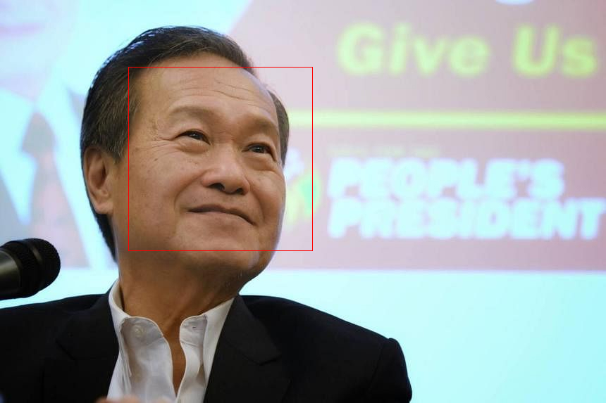

# ImageRecognition App

This is an imageRecognition app made in C++ implementing the inference part of the Viola-Jones algorithm. It uses integral sums and a sliding window to identify the haar features to find faces, eyes, or mouths.

This project is OpenCL accelerated but there are also methods to run on a single-threaded CPU.

## Build Instructions

To build this project, clone the repository:

```bash
git clone https://github.com/han3101/openCL-ImageRecognition.git
```

Use CMake to build the executable:

```bash
mkdir build
cd build
cmake ../
```

If you want to profile the runtimes on OpenCL:

```bash
cmake -DPROFILE=1 ../
```

To run the program, edit the main.cpp file and run. You will also need to create an imgs folder and store your images there:
```bash
make -r
```
To clean up the project, run:
```bash
make clean-all
```

# Demo


# TODO
1. Fix up detection accuracy.
2. Fix up edge density speed up to ignore parts of the image that are not close.
3. Update main.cpp to handle command line arguments instead.
4. Configure CMAKE file to have a order of priority where it tries OpenCL -> CPU OpenMP -> CPU single-threaded. 


